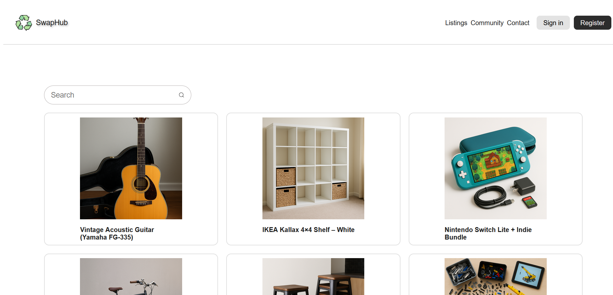

# Dokumentation for SwapHub.

Azad Karaman

WU12

Valgfri opgave:
Jeg har lavet valgfri opgave c, hvor der skal oprettes en ny bruger, det sker inde under register siden.





Sådan starter du projekt op:
`npm run dev`
Giver et link som kan åbnes igennem din browser.


Sådan starter du serveren op:
`Cd api`,
`npm start`
Giver besked i terminalen at serveren er klar i port 4000.


## Tech-stack

* **React**  
React er et bibliotek der giver mig mulighed for at lave komponenter og er nem at bruge og velligeholde sin kode og have struktur over den. Det er også det mest brugte frontend bibliotek i verden.

Alternativer:
Vue.
Angular, komplet framework, som er baseret på typescript

Begrundelse for valget:
Kender bedst til react og har nemmest ved det, det er nemt at arbejde med og passer godt med javascript.


* **Git & Github**  
Git er versionsstyring, og GitHub er en hostingplatform til at gemme og arbejde på kodeprojekter, det bruges til at holde styr på ændringer, arbejde i branches og til kodegennemgang.


Alternativer:
GitLab.

Begrundelse for valget:
Git og GitHub er standarden i de fleste moderne udviklingsmiljøer, men også det vi har arbejdet med på skolen.

* **React-icons**  
Et ikon-bibliotek, som er beregnet på React.

Alternativer:
Font Awesom

Begrundelse for valget:
Nem at bruge og nemt at importere icons.


* **SASS**  

Sass er en CSS preprocessor, der giver mulighed for variabler, nesting, mixins og mere genanvendelig styling. Det gør det nemmere at organisere og skalere.

Alternativer:
Almindelig CSS er simpelt, men uden de ekstra funktioner Sass giver.
Tailwind CSS skriver man direkte ind med klasser i den.

Begrundelse for valget:
Kender bedst til Sass, nemt at sætte op og holde styr på sine styling og navne


## Styling

* **Fonts:**
  'Open Sans', 'Helvetica Neue', Helvetica, Arial, sans-serif;

* **Farver:**
#f5f5f5,
#2c2c2c,
#e3e3e3,
#212121,

* **Skriftstørrelser:**
16px,
18px,
24px,
36px,

## Kode-eksempel
```jsx

import { useEffect, useState } from 'react';

function Home() {
  const [items, setItems] = useState([]);
  const [search, setSearch] = useState("");

  useEffect(() => {
    const fetchItems = async () => {
      const response = await fetch("http://localhost:4000/api/v1/listings");
      const data = await response.json();
      setItems(data);
    };

    fetchItems();
  }, []);

  const searchHandler = value => {
    setSearch(value); 
  }

  const filteredItems = items.filter(item => 
    item.title.toLowerCase().includes(search.toLowerCase())
  )


 return (
{filteredItems.map((item) => (

 
<p>{item.title}</p>
 ))}


 )
```

Der laves først et komponent som kaldes home da vi er på forsiden, der er lavet to tomme states, den ene er til varer som skal vises frem, den anden er til vores søgefelt.

Så kører vi en useEffect også kaldt en react hook som skal hente data til os igennem api'et, vi laver en variable som vi kalder fetchItems den bliver lavet asynkron, hvor vi efterfølgende laver await både på fetch og response, vi laver en await fordi vi gerne vil have hele dataen før vi får noget, vi beder også om at få dataen i json, når vi så har fået data, så gemmer den dataen i vores state og vi får vist vores data tilsidst.

Koden under useEffect er til søgefunktionen, vi laver en variable som bliver kaldt searchHandler, den tager det brugeren skriver ind i søgefeltet og kalder setSearch og opdatere vores state med det som er blevet søgt på, det er derfor man kan se den altid opdatere sig hver gang man skriver.

Efterfølgende laver vi en ny variable som bliver kaldt filterItems, vi kalder vores .filter som er en metode hvor den laver et callback, vi rammer kun titlen på varene, men vi har også lavet en toLowercase som er en metode som gøre alt småt i vores søgefelt, vi laver også en .includes som også er en metode som tjekker det vi søger efter findes.


Tilsidst skal vi have det hele ud, så vi går indunder og skriver i vores return, vi laver en .map som er en metode som giver os dataen.
